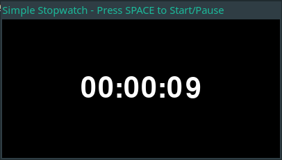

# Stop Watch

Simple stopwatch made using Chat GPT.
Use tkinter for the ui.



## Run

```sh
$ python stop_watch.py
```

- Press SPACE to start or pause.
- Press ESCAPE or Q to exit.

## ChatGTP

### Version

GPT-4o mini (2024/10/13)

### Prompts

1. writes me a simple stopwatch with big digits in python + pygame zero.

   Starting / Stopping the clock si made by pressing SPACE.

   It should display times as HH:MM:SS in 24h format.

2. Do it again.

   Use a class holding everything about the time. We use it with its methods :

   - init to create a non startted stop watch
   - start run the clock and initialise the time
   - pause to pause the time
   - draw to display. Stopped time is drawned in grey, running time in white

   Use a correct title for the window

I adapted the rest myself.
